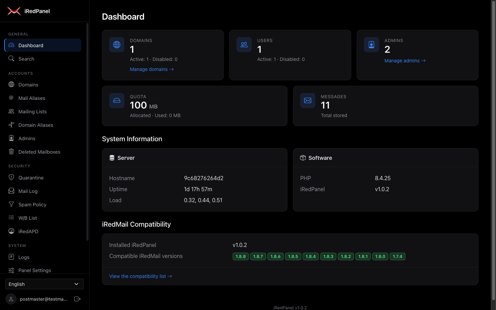

# iRedPanel

A PHP web application for managing [iRedMail](https://www.iredmail.org/) mail servers. It supports the OpenLDAP, MySQL/MariaDB and PostgreSQL backends, with optional Amavisd, Fail2ban and iRedAPD integrations. It includes a black dark-theme web UI in 40 languages, a REST API, mail alias and mailing list management, spam policy control, and role-based admin access.

The application is vanilla PHP 8.1+ with no framework, no ORM and no template engine. Runtime dependencies are `vlucas/phpdotenv` (environment configuration) and `phpmailer/phpmailer` (outgoing mail). The UI uses vendored Bootstrap 5.3, Bootstrap Icons, SweetAlert2 and Tom Select.



| Project    | Value                                                |
|------------|------------------------------------------------------|
| Package    | `kilimcininkoroglu/iredpanel`                        |
| Version    | `1.0.5`                                              |
| iRedMail   | Compatible with `1.7.4` and `1.8.0` to `1.8.8`       |
| Repository | `https://github.com/KilimcininKorOglu/iRedPanel.git` |
| License    | MIT                                                  |

## Contents

- [Supported Backends](#supported-backends)
- [iRedMail Compatibility](#iredmail-compatibility)
- [Requirements](#requirements)
- [Installation](#installation)
- [Configuration](#configuration)
- [Running](#running)
- [Web UI](#web-ui)
- [Features](#features)
- [REST API](#rest-api)
- [CLI Tools](#cli-tools)
- [Authentication and Access Control](#authentication-and-access-control)
- [Architecture](#architecture)
- [Project Structure](#project-structure)
- [Development and Testing](#development-and-testing)
- [License](#license)

## Supported Backends

| iRedMail backend | Supported | `IREDPANEL_BACKEND` |
|------------------|-----------|---------------------|
| OpenLDAP         | Yes       | `ldap`              |
| MySQL/MariaDB    | Yes       | `mysql`             |
| PostgreSQL       | Yes       | `pgsql`             |

With the LDAP backend, mail accounts live in LDAP, and the iRedAdmin, Amavisd and iRedAPD data live in SQL databases, as in a standard iRedMail LDAP installation.

## iRedMail Compatibility

| iRedPanel | Compatible iRedMail versions | Backends | Released |
|-----------|------------------------------|----------|----------|
| 1.0.5     | 1.7.4, 1.8.0, 1.8.1, 1.8.2, 1.8.3, 1.8.4, 1.8.5, 1.8.6, 1.8.7, 1.8.8 | OpenLDAP, MySQL/MariaDB, PostgreSQL | 2026-09-20 |
| 1.0.4     | 1.7.4, 1.8.0, 1.8.1, 1.8.2, 1.8.3, 1.8.4, 1.8.5, 1.8.6, 1.8.7, 1.8.8 | OpenLDAP, MySQL/MariaDB, PostgreSQL | 2026-09-20 |
| 1.0.3     | 1.7.4, 1.8.0, 1.8.1, 1.8.2, 1.8.3, 1.8.4, 1.8.5, 1.8.6, 1.8.7, 1.8.8 | OpenLDAP, MySQL/MariaDB, PostgreSQL | 2026-09-20 |
| 1.0.2     | 1.7.4, 1.8.0, 1.8.1, 1.8.2, 1.8.3, 1.8.4, 1.8.5, 1.8.6, 1.8.7, 1.8.8 | OpenLDAP, MySQL/MariaDB, PostgreSQL | 2026-07-26 |

[`compatibility.json`](compatibility.json) is the source of this table. It maps every iRedPanel release to the iRedMail versions that it is compatible with. The panel runs on the iRedMail 1.7.4 test stacks. A later iRedMail version enters the list after its ChangeLog, its upgrade guide on docs.iredmail.org and its schema files (`vmail`, `iredadmin`, `amavisd`, `iredapd` and the LDAP schema), including the bundled iRedAdmin, iRedAPD and mlmmjadmin releases, show no change that the panel depends on. The first iRedMail version with such a change needs a new iRedPanel release.

- The panel reads the copy on the `main` branch of GitHub, so an installed panel also sees newer releases. It caches the download for 24 hours. When GitHub cannot be read, or `CHECK_UPDATES=false`, it uses the copy bundled with the installed version.
- **System > iRedMail Compatibility** (`/compatibility`, global admin) lists every release and marks the installed one. The dashboard shows the compatible iRedMail versions of the installed release, and an alert when a newer release exists.
- The panel does not detect the iRedMail version of the server. Compare it with the list yourself (`cat /etc/iredmail-release` on the mail server).
- Upgrade order: upgrade iRedMail first, then install the iRedPanel release that lists the new iRedMail version.

A new release needs an entry in `compatibility.json` with its `composer.json` version; a unit test fails otherwise.

## Requirements

- PHP 8.1 or higher
- `ext-ldap` for the LDAP backend
- `ext-pdo` and `ext-pdo_mysql` for the MySQL/MariaDB backend, and for the SQL integrations of an LDAP installation
- `ext-pdo` and `ext-pdo_pgsql` for the PostgreSQL backend
- `ext-sodium` for account replication from Active Directory (included in most PHP builds)
- [Composer](https://getcomposer.org/) 2
- An iRedMail server with an OpenLDAP, MySQL/MariaDB or PostgreSQL backend
- For mailing lists: the [mlmmjadmin](https://github.com/iredmail/mlmmjadmin) API of the mail server

## Installation

The installation guides cover a native install on the iRedMail server (Nginx and PHP-FPM, or Apache) and a Docker install, including the credentials to collect from the mail server and the network changes that a container needs:

| Backend | English | Turkish |
|---------|---------|---------|
| OpenLDAP | [docs/install/en/ldap.md](docs/install/en/ldap.md) | [docs/install/tr/ldap.md](docs/install/tr/ldap.md) |
| MariaDB/MySQL | [docs/install/en/mariadb.md](docs/install/en/mariadb.md) | [docs/install/tr/mariadb.md](docs/install/tr/mariadb.md) |
| PostgreSQL | [docs/install/en/postgresql.md](docs/install/en/postgresql.md) | [docs/install/tr/postgresql.md](docs/install/tr/postgresql.md) |

Short form:

```bash
git clone https://github.com/KilimcininKorOglu/iRedPanel.git
cd iRedPanel
git checkout v1.0.5
composer install --no-dev --optimize-autoloader
cp .env.example .env
```

Edit `.env` with the backend and its connection details, then start the application (see [Running](#running)).

## Configuration

All settings use the `IREDPANEL_` prefix and are loaded from `.env` or `.env.prod` via [vlucas/phpdotenv](https://github.com/vlucas/phpdotenv). The tables below omit the prefix. `.env.example` is the complete template.

### General Settings

| Variable     | Default | Description                                   |
|--------------|---------|-----------------------------------------------|
| `BACKEND`    | `ldap`  | `ldap`, `mysql` or `pgsql`                    |
| `SECRET_KEY` | -       | Application secret key (required). It also encrypts the bind passwords of account resources; after a change, enter them again |

### LDAP Settings (required when `BACKEND=ldap`)

| Variable          | Default | Description                               | Example                    |
|-------------------|---------|-------------------------------------------|----------------------------|
| `LDAP_URI`        | -       | LDAP server URI (`ldap://` or `ldaps://`) | `ldaps://ldap.example.com` |
| `LDAP_ROOT_DN`    | -       | LDAP root DN                              | `dc=example,dc=com`        |
| `LDAP_USER`       | -       | Service bind: admin email, CN or full DN  | `postmaster@example.com`   |
| `LDAP_PASSWORD`   | -       | Password of the service bind              | `secret`                   |
| `LDAP_TLS_VERIFY` | `false` | Verify the TLS certificate of the server  | `true`                     |

### MySQL/MariaDB Settings (required when `BACKEND=mysql`)

| Variable         | Default      | Description                         |
|------------------|--------------|-------------------------------------|
| `MYSQL_HOST`     | -            | Database server hostname            |
| `MYSQL_PORT`     | `3306`       | Database server port                |
| `MYSQL_DATABASE` | -            | Database name (e.g. `vmail`)        |
| `MYSQL_USER`     | -            | Database user                       |
| `MYSQL_PASSWORD` | -            | Database password                   |

### PostgreSQL Settings (required when `BACKEND=pgsql`)

| Variable         | Default  | Description                         |
|------------------|----------|-------------------------------------|
| `PGSQL_HOST`     | -        | Database server hostname            |
| `PGSQL_PORT`     | `5432`   | Database server port                |
| `PGSQL_DATABASE` | -        | Database name (e.g. `vmail`)        |
| `PGSQL_USER`     | -        | Database user                       |
| `PGSQL_PASSWORD` | -        | Database password                   |

### Mail Storage (MySQL/MariaDB and PostgreSQL)

| Variable       | Default      | Description                         |
|----------------|--------------|-------------------------------------|
| `VMAIL_PATH`   | `/var/vmail` | Mail storage base path              |
| `STORAGE_NODE` | `vmail1`     | Storage node name for new mailboxes |

### Mailing Lists and Outgoing Mail

Mailing lists live in the mlmmj spool on the mail server. The panel creates, updates and deletes them, and manages their owners, moderators and subscribers, through the mlmmjadmin RESTful API. Newsletter confirmation mail and the quarantine notification CLI send mail through SMTP.

| Variable               | Default    | Description                                                      |
|------------------------|------------|------------------------------------------------------------------|
| `MLMMJADMIN_API_URL`   | -          | mlmmjadmin API base URL, for example `http://127.0.0.1:7790/api` |
| `MLMMJADMIN_API_TOKEN` | -          | One of `api_auth_tokens` in `/opt/mlmmjadmin/settings.py`        |
| `SMTP_HOST`            | -          | SMTP server hostname                                             |
| `SMTP_PORT`            | `587`      | SMTP port (`465` when `SMTP_SECURITY=tls`)                       |
| `SMTP_SECURITY`        | `starttls` | `none`, `starttls` or `tls`                                      |
| `SMTP_TLS_VERIFY`      | `true`     | Verify the TLS certificate of the SMTP server                    |
| `SMTP_USER`            | -          | SMTP AUTH user (empty disables AUTH)                             |
| `SMTP_PASSWORD`        | -          | SMTP AUTH password                                               |
| `SMTP_FROM`            | -          | Sender address of mail sent by the panel                         |
| `PUBLIC_URL`           | -          | Public base URL of the panel, used in links sent by mail         |

### Panel Behavior (database-overridable)

These values are the initial defaults. When the iRedAdmin database is configured, a global admin can also change them in **Panel Settings** (`/panel-settings`). A database value takes precedence over the `.env` value.

| Variable                                | Default   | Description                                                  |
|-----------------------------------------|-----------|--------------------------------------------------------------|
| `PASSWORD_MIN_LENGTH`                   | `8`       | Minimum password length                                      |
| `PASSWORD_INCLUDES_SPECIAL_CHARS`       | `true`    | Require special characters in passwords                      |
| `PASSWORD_INCLUDES_NUMBERS`             | `true`    | Require digits in passwords                                  |
| `PASSWORD_INCLUDES_LOWERCASE`           | `true`    | Require lowercase letters in passwords                       |
| `PASSWORD_INCLUDES_UPPERCASE`           | `true`    | Require uppercase letters in passwords                       |
| `PASSWORD_HASHES_USE_PREFIXED_SCHEME`   | `true`    | Write the `{SCHEME}` prefix in password hashes               |
| `PASSWORD_DEFAULT_SCHEME`               | `SSHA512` | Default password hashing scheme                              |
| `REQUIRE_OLD_PASSWORD_ON_CHANGE`        | `false`   | Require the current password for a password change           |
| `DEFAULT_LANGUAGE`                      | `en_US`   | Default UI locale code (for example `en_US`, `tr_TR`, `de_DE`) |
| `PAGINATION_PER_PAGE`                   | `50`      | Items per page on list views                                 |
| `SESSION_TIMEOUT`                       | `1800`    | Session timeout in seconds                                   |
| `ALLOWED_IP_RANGES`                     | -         | Comma-separated CIDR ranges that may open the panel          |
| `SESSION_VALIDATE_IP`                   | `false`   | End the session when the client IP changes                   |
| `CHECK_UPDATES`                         | `true`    | Read `compatibility.json` from GitHub for newer releases     |
| `GEOIP_DB_PATH`                         | -         | Path to a MaxMind GeoLite2-City `.mmdb` file                 |
| `REQUIRE_DOMAIN_OWNERSHIP_VERIFICATION` | `false`   | Require DNS TXT verification for new domains                 |
| `NEWSLETTER_EXPIRE_HOURS`               | `24`      | Expiry of newsletter confirmation tokens                     |
| `BRAND_NAME`                            | `iRedPanel` | Panel name in the UI and the page title                    |
| `BRAND_LOGO_URL`                        | `/static/logo-iredmail.png` | Logo URL in the sidebar and on the login page |
| `BRAND_FOOTER_TEXT`                     | -         | Custom footer text                                           |
| `BRAND_PRIMARY_COLOR`                   | -         | Accent color of the UI (CSS color value)                     |

### REST API (optional)

| Variable          | Default | Description                                            |
|-------------------|---------|--------------------------------------------------------|
| `API_ENABLED`     | `false` | Enable the REST API at `/api/v1/*`                     |
| `API_KEY`         | -       | Global API key with full access (sent as `X-API-Key`) |
| `API_ALLOWED_IPS` | -       | Comma-separated IPs or CIDR ranges that may use the API |

### Integration Databases

The default port of every integration database follows the backend: `5432` when `BACKEND=pgsql`, otherwise `3306`.

**iRedAdmin database** (activity log, panel settings, domain ownership, newsletter tokens, and, with LDAP, deleted mailboxes, last logins and used quota):

| Variable                   | Default     | Description                 |
|----------------------------|-------------|-----------------------------|
| `ACTIVITY_LOGGING_ENABLED` | `true`      | Enable the activity log     |
| `IREDADMIN_DB_HOST`        | -           | Database host               |
| `IREDADMIN_DB_PORT`        | see above   | Database port               |
| `IREDADMIN_DB_NAME`        | `iredadmin` | Database name               |
| `IREDADMIN_DB_USER`        | -           | Database user               |
| `IREDADMIN_DB_PASSWORD`    | -           | Database password           |

**Amavisd** (quarantine, mail log, spam policy, white/blacklist):

| Variable                             | Default           | Description                                        |
|--------------------------------------|-------------------|----------------------------------------------------|
| `AMAVISD_ENABLED`                    | `false`           | Enable the Amavisd pages                           |
| `AMAVISD_DB_HOST`                    | -                 | Database host                                      |
| `AMAVISD_DB_PORT`                    | see above         | Database port                                      |
| `AMAVISD_DB_NAME`                    | `amavisd`         | Database name                                      |
| `AMAVISD_DB_USER`                    | -                 | Database user                                      |
| `AMAVISD_DB_PASSWORD`                | -                 | Database password                                  |
| `AMAVISD_QUARANTINE_HOST`            | `AMAVISD_DB_HOST` | Host of the Amavisd AM.PDP port for message release |
| `AMAVISD_QUARANTINE_PORT`            | `9998`            | Amavisd AM.PDP port                                |
| `AMAVISD_REMOVE_QUARANTINED_IN_DAYS` | `7`               | Quarantine retention in days                       |
| `AMAVISD_REMOVE_MAILLOG_IN_DAYS`     | `7`               | Mail log retention in days                         |

**iRedAPD** (throttle, greylisting, rDNS white/blacklist, SenderScore whitelist):

| Variable              | Default   | Description             |
|-----------------------|-----------|-------------------------|
| `IREDAPD_ENABLED`     | `false`   | Enable the iRedAPD pages |
| `IREDAPD_DB_HOST`     | -         | Database host           |
| `IREDAPD_DB_PORT`     | see above | Database port           |
| `IREDAPD_DB_NAME`     | `iredapd` | Database name           |
| `IREDAPD_DB_USER`     | -         | Database user           |
| `IREDAPD_DB_PASSWORD` | -         | Database password       |

### Fail2ban (optional)

| Variable           | Default                        | Description                   |
|--------------------|--------------------------------|-------------------------------|
| `FAIL2BAN_ENABLED` | `false`                        | Enable ban/unban management   |
| `FAIL2BAN_SOCKET`  | -                              | Custom fail2ban-client socket |
| `FAIL2BAN_JAILS`   | `dovecot,postfix,postfix-sasl` | Comma-separated jail names    |

### Password Schemes

| Support | Schemes |
|---------|---------|
| Hash generation | `SSHA512`, `SHA512`, `SSHA`, `BCRYPT`, `MD5`, `PLAIN-MD5`, `PLAIN` |
| Hash generation with the external `doveadm` command (falls back to `SSHA` when `doveadm` is missing) | `CRAM-MD5`, `NTLM` |
| Verification of existing hashes only | `SHA`, `CRYPT`, `SHA512-CRYPT` |

## Running

### Development Server

```bash
php -S localhost:8080 -t public/
```

Open `http://localhost:8080`. The panel redirects to the login page, then to the dashboard.

### Docker

The `Dockerfile` builds a PHP 8.4 + Apache image with the `ldap`, `pdo_mysql` and `pdo_pgsql` extensions, so one image serves every backend. It has two targets:

| Target | Compose file              | Host port        | Code |
|--------|---------------------------|------------------|------|
| `dev`  | `docker-compose.dev.yml`  | `127.0.0.1:8521` | Repository bind-mounted; reads `.env` and the host `vendor/` |
| `prod` | `docker-compose.prod.yml` | `127.0.0.1:8522` | Copied into the image with production Composer dependencies; reads `.env.prod` |

```bash
composer install                   # dev only: vendor/ comes from the host
make dev-up                        # or: make prod-up
make dev-up ENV=.env.other         # dev with another env file mounted as .env
```

Both compose files join the external `iredpanel` Docker network, which `make network` creates. A backend container on the same network is reachable by container name and container port, for example `IREDPANEL_MYSQL_HOST=iredmail-mariadb` with port `3306`.

The panel serves plain HTTP. Put a TLS-terminating reverse proxy in front of the production container before you publish it beyond loopback. The session cookie gets the `secure` flag only when PHP sees HTTPS directly.

### Apache

Point the document root to the `public/` directory. The included `.htaccess` rewrites the URLs.

```apache
<VirtualHost *:80>
    DocumentRoot /path/to/iredpanel/public
    <Directory /path/to/iredpanel/public>
        AllowOverride All
        Require all granted
    </Directory>
</VirtualHost>
```

### Nginx

```nginx
server {
    listen 80;
    root /path/to/iredpanel/public;
    index index.php;

    location / {
        try_files $uri $uri/ /index.php?$query_string;
    }

    location ~ \.php$ {
        fastcgi_pass unix:/run/php/php-fpm.sock;
        fastcgi_param SCRIPT_FILENAME $document_root$fastcgi_script_name;
        include fastcgi_params;
    }
}
```

## Web UI

- **Layout**: black dark theme on Bootstrap 5.3 with a grouped left sidebar (General, Accounts, Security, System). On small screens the sidebar opens as an offcanvas menu. The menu shows only the pages that the admin role and the enabled integrations allow.
- **Dialogs and messages**: every delete and bulk action asks for confirmation in a SweetAlert2 dialog. Results appear as toast messages.
- **Account pickers**: address fields search the account list while you type (Tom Select) and still accept a free-text address. Multi-address fields: alias members and moderators, mailing list owners, moderators and subscribers, forwarding addresses, greylisting whitelisted senders. Single-address fields: domain and user BCC, catch-all target, admin creation, spam policy and white/blacklist accounts, mail log filter, alias quick add. The pickers call `GET /ajax/accounts`, a session endpoint that returns at most 20 active users, aliases and mailing lists, limited to the domains of a domain admin.
- **Colored badges**: categorical values and counters use one color map (`App\BadgeTone`), so the same meaning has the same color on every page. Allowed or clean values are green, dangerous values are red, restricted values are orange or yellow, and plain information is blue, cyan or purple. This covers activity log events, admin type, access policy, mail content type, throttle kind, white/blacklist entries, domain ownership, setting source, replication events and status, the "Active Directory" badge of replicated accounts, and item counters. An unknown value is gray.
- **Branding**: panel name, logo, footer text and accent color (`BRAND_*`).
- **Languages**: 40 UI languages with a switcher in the sidebar and on the login page.

## Features

### Domain Management
- Domain CRUD on all three backends
- Domain settings: default user quota, password length rules, disclaimer text
- Alias domains that point to a target domain
- Catch-all address, sender and recipient BCC, and sender-dependent relay host per domain
- Domain ownership verification with DNS TXT records
- Enable, disable and delete in bulk; paginated list with status filter

### User Management
- User CRUD with profile fields (name, quota, phone, employee ID and more)
- Mail service toggles: SMTP, POP3, IMAP, ManageSieve, SOGo, and their TLS variants
- Forwarding with a keep-copy option, per-user alias addresses, sender and recipient BCC, relay host, and a per-user Postfix transport (global admin only)
- Address rename that updates every related table
- Used quota and last login display (Dovecot `used_quota` and `last_login` data)
- Bulk enable, disable and delete, and a bulk language, password or transport change; alphabetic filter, sortable columns, random password generation
- Domain limits (maximum mailboxes and quota) checked in the web form, the REST API and the CLI
- New mailbox options, as in iRedAdmin: a password hash instead of a password (`{SSHA512}`, `{CRYPT}`, `{BCRYPT}` and the other iRedMail schemes; the password policy does not check a hash), the language, the mailbox format (`maildir`, `mdbox`, `sdbox`) and folder, and, for a global admin only, an absolute maildir path. A path that another mailbox uses, or that lies inside another mailbox, is refused

### Mail Alias Management
- Alias CRUD with member and moderator management
- Access policies: `public`, `domain`, `membersOnly`, `moderatorsOnly`
- Bulk enable, disable and delete; paginated list with domain filter

### Mailing List Management (mlmmj)
- Mailing list CRUD; the mlmmj list itself is managed through the mlmmjadmin API
- Owner, moderator and subscriber management (web UI and REST API)
- An empty owner or moderator list becomes `postmaster@<domain>`, the mlmmjadmin default
- Access policy, maximum message size and newsletter settings
- Bulk enable, disable and delete

### Admin Management
- Standalone and mailbox-based admin accounts
- Domain assignment per admin, and global admin promotion or revocation
- Resource limits per admin: domains, users, aliases, mailing lists, quota

### Spam Policy and White/Blacklist (Amavisd)
- Global, per-domain and per-user spam thresholds (tag, tag2 and kill levels)
- Bypass and delivery options for virus, spam, banned files and bad headers
- Inbound (sender) and outbound (recipient) white/blacklists per account
- Quarantine viewer with release and delete, mail log, and configurable cleanup

### iRedAPD
- Per-account throttle settings (inbound, outbound, external)
- A throttle account must be a form that iRedAPD looks up: an email address, a domain, a subdomain or top-level domain (`@.example.com`, `@.com`), the catch-all `@.`, an IP address or an IPv4 wildcard. A CIDR network or `user@*` is rejected, because the iRedAPD throttle plugin never matches it
- Greylisting toggle, whitelisted senders and tracking data, the accounts that have an own setting, and the removal of one account's setting with its whitelisted senders
- Whitelisted domains whose SPF records the iRedAPD job resolves into whitelisted senders, with the resolved senders per domain
- rDNS white/blacklist and SenderScore permanent whitelist
- The SMTP sessions that iRedAPD recorded (`iredapd.smtp_sessions`), filtered by action, address or client IP, with a detail page per session. A row adds its sender to the inbound white/blacklist of the recipient, or its rDNS name to the rDNS white/blacklist. iRedAPD writes the table while `LOG_SMTP_SESSIONS` is on and removes the old rows itself

### Fail2ban
- Jail status, and ban or unban of IP addresses
- Optional GeoIP country and city display (MaxMind GeoLite2)

### Account Settings Cleanup
- As in iRedAdmin-Pro, deleting a user, alias, mailing list or domain also deletes its Amavisd policy and white/blacklist and its iRedAPD throttle and greylisting settings. Renaming a user moves them to the new address. Only the enabled integrations are updated.

### Account Replication (Active Directory)
- **System > Account Resources** (global admin) replicates mail users, and optionally groups as mail aliases, from Active Directory or a Samba AD domain controller into one hosted domain, as the iRedMail Enterprise Edition "Account Resources" feature does
- Connection over LDAPS (port 636) or StartTLS, with optional certificate verification; the bind password is encrypted in the iRedAdmin database
- "Test connection" shows the first users and groups with their mapped values
- The email address comes from `userPrincipalName` (users) and `mail` (groups) by default; the profile fields and the account status (`userAccountControl`) are mapped per resource
- Created, updated, renamed, disabled and re-enabled accounts are written to a replication log per run and to the activity log
- A local account that already uses an address is not changed; the run logs a conflict
- An account that disappears from the directory is disabled, never deleted. When the search returns nothing, or more than half of ten or more accounts disappear at once, nothing is disabled (override with `--allow-mass-disable`)
- Passwords are not replicated. A new mailbox gets a random password; set the password in the panel
- The directory-owned fields are read-only in the web UI, kept by the web forms, and rejected by the REST API with 409
- `cli/replicateAccounts.php` runs from cron every minute and replicates each enabled resource when its interval has passed. A database lock keeps a cron run and a "Replicate now" click apart

### Global Search
- Search across domains, users, aliases, mailing lists and admins
- Account type and status filters
- Domain admins see only their managed domains

### Dashboard
- Domain, user and admin counts with active and disabled totals
- Allocated and used quota, and stored message count
- System information: hostname, uptime, load, PHP and panel versions
- Compatible iRedMail versions of the installed release, and an alert for a newer release (see [iRedMail Compatibility](#iredmail-compatibility))

### Activity Log
- Admin operations are logged to the `log` table of the iRedAdmin database
- Log viewer with domain and event filters and colored event badges
- A failed login is marked as an error
- Delete selected entries or all entries (global admin)

### Deferred Mailbox Deletion
- A deleted mailbox is recorded with a scheduled deletion date (`vmail.deleted_mailboxes` for SQL, `iredadmin.deleted_mailboxes` for LDAP)
- The admin chooses how long the mailbox stays on disk when a user or a domain is deleted, as in iRedAdmin: a domain admin 1 to 365 days, a global admin also 730 or 1095 days or forever. The REST API reads the query parameter `keepMailboxDays` of `DELETE /api/v1/users/{email}` and `DELETE /api/v1/domains/{domain}`; without it the mailbox is kept forever
- View, cancel and reschedule pending deletions
- `cli/deleteExpiredMailboxes.php` removes the maildirs when the date is reached

### Export
- Users of a domain as CSV or JSON
- Admin statistics as CSV or JSON
- Cells that start with a formula character are prefixed to prevent spreadsheet formula injection

### Newsletter Subscription
- Public subscribe and unsubscribe pages at `/newsletters/{subscribe,unsubscribe}/<mlid>` for active lists with the newsletter flag (SQL backends only)
- A confirmation link is sent by SMTP, built from `PUBLIC_URL`, and expires after `NEWSLETTER_EXPIRE_HOURS`
- A confirmed request adds or removes the subscriber in mlmmj

### Panel Settings
- 44 settings editable at `/panel-settings` (global admin only)
- Categories: Branding, Password Policy, Session & Security, Display & Behavior, Integrations, Outgoing Mail, REST API
- The REST API key, the SMTP password and the mlmmjadmin API token are write-only fields: the page never shows a stored value, an empty field keeps it and a checkbox clears it. The two secrets are stored encrypted with libsodium `secretbox`
- Stored in the `panel_settings` table of the iRedAdmin database
- Priority: database value, then `.env` value, then built-in default
- Falls back to `.env` when the iRedAdmin database is not configured

### Security
- CSRF token on every POST form, compared with `hash_equals()`
- Session ID regeneration after login, session timeout, optional session IP check
- Open redirect prevention on the login redirect target
- `secure`, `httponly` and `samesite=Lax` session cookie (secure only over HTTPS)
- Panel access restriction by CIDR ranges
- Route parameters override form body values
- Passwords are piped to external commands through stdin, never passed as arguments
- API key comparison with `hash_equals()` and optional API IP restriction
- Configurable LDAP TLS certificate verification
- Account resource bind passwords are encrypted with libsodium `secretbox`, with a key derived from `SECRET_KEY`, and never written back to the page

## REST API

The REST API lives at `/api/v1/*`. It is disabled by default (`API_ENABLED=false`). Every request sends an API key in the `X-API-Key` header.

**Keys**: the panel first looks up the key in the `panel_api_keys` table of the iRedAdmin database. A stored key has a role (global or domain-scoped), a domain list and a read-only flag. The `API_KEY` value from `.env` works as a global key with full access. `API_ALLOWED_IPS` applies to every key.

| Resource | Endpoints |
|----------|-----------|
| Domains | `GET, POST /domains`; `GET, PUT, DELETE /domains/{domain}` |
| Users | `GET, POST, PUT /domains/{domain}/users`; `GET, PUT, DELETE /users/{email}` |
| Aliases | `GET, POST /aliases`; `GET, PUT, DELETE /aliases/{address}` |
| Mailing lists | `GET, POST /mailing-lists`; `GET, PUT, DELETE /mailing-lists/{address}` |
| List subscribers | `GET, POST, DELETE /mailing-lists/{address}/subscribers` |
| List moderators | `GET, PUT /mailing-lists/{address}/moderators` |
| Mail lists | `GET, POST /mail-lists`; `GET, PUT, DELETE /mail-lists/{address}` (LDAP backend) |
| Admins | `GET, POST /admins`; `GET, PUT, DELETE /admins/{email}` |
| Domain aliases | `GET, POST /domain-aliases`; `DELETE /domain-aliases/{aliasDomain}` |
| Password check | `POST /verify-password/{accountType}/{email}` |
| Spam policy | `GET, PUT, DELETE /spam-policy/{account}` |
| White/blacklist | `GET, POST, DELETE /wblist/{account}` |
| Throttle | `GET, PUT /throttle/{account}` |
| LDIF export | `GET /ldif`; `GET /ldif/{domain}` (LDAP backend) |
| Greylisting | `GET /greylist`; `GET, PUT, DELETE /greylist/{account}`; `GET, PUT /greylist-whitelist-domains` |

**Mailing lists**: `GET /mailing-lists/{address}` returns the mlmmj profile under `options`, and `?withSubscribers=yes` adds the subscribers. `PUT` writes the option fields that the body carries. `POST /mailing-lists/{address}/subscribers` accepts `subscription` (`normal`, `digest`, `nomail`) and `requireConfirm`. `DELETE /mailing-lists/{address}?keepArchive=no` removes the messages of the list with the account.

**Mail lists**: a mail list is a group account of the LDAP backend. The admin manages its members, and a member cannot subscribe or unsubscribe itself. A SQL backend has no such account type and answers 400. `PUT /mail-lists/{address}` writes the fields that the body carries, and changes the members with `members`, or with `addMembers` and `removeMembers`. A member address outside the served domains becomes a `mailExternalUser` entry.

**White/blacklist**: `GET /wblist/{account}?wb=W` (or `B`) returns one kind only. `POST` takes a single `sender` or a `senders` array, with `wb` (`W` or `B`) and `direction` (`inbound` or `outbound`). `DELETE` takes `sender`, `senders`, or `{"all": true}` with the optional `wb` filter, and answers with the number of entries it changed.

**LDIF export**: `GET /ldif` returns the whole LDAP tree and `GET /ldif/{domain}` the subtree of one domain, as LDIF text instead of JSON, so the answer goes straight into `ldapadd`. Both need a global key and the LDAP backend; a SQL backend answers 400. The file holds the password hashes.

**Greylisting**: `GET /greylist` lists the accounts that have an own setting. `PUT /greylist/{account}` sets `enabled` and either replaces `whitelistedSenders` or changes it with `addSenders` and `removeSenders`. `DELETE /greylist/{account}` removes the setting and the whitelisted senders of the account. `GET /greylist-whitelist-domains` returns the whitelisted domains and the senders that the iRedAPD job resolved from their SPF records; `PUT` takes `domains`, `addDomains` or `removeDomains`.

**Incremental list fields**: a `PUT` body either replaces a list or changes it one item at a time: `forwardings`/`addForwardings`/`removeForwardings` and `aliases`/`addAliases`/`removeAliases` and `services`/`addServices`/`removeServices` on a user, `members`/`addMembers`/`removeMembers` on a mail alias, and `addAdmins`/`removeAdmins` on a domain. The full field and its add/remove pair are refused together.

**List filters**: every list endpoint pages with `?page` and `?perPage`. `?disabledOnly=yes` returns only the disabled accounts, and `?emailOnly=yes` (`?nameOnly=yes` for domains) returns the addresses instead of the profiles.

Responses are JSON. An unknown API route returns a JSON 404, an unreachable backend a JSON 503, and any other error a logged JSON 500.

```bash
# List domains
curl -H "X-API-Key: your-key" http://localhost:8080/api/v1/domains

# Create a user
curl -X POST -H "X-API-Key: your-key" -H "Content-Type: application/json" \
  -d '{"uid":"john","password":"P@ss123","mailQuota":1024}' \
  http://localhost:8080/api/v1/domains/example.com/users

# Create a user from a password hash, with the mailbox format, folder and path (global key)
curl -X POST -H "X-API-Key: your-key" -H "Content-Type: application/json" \
  -d '{"uid":"jane","passwordHash":"{SSHA512}...","mailboxFormat":"mdbox","mailboxFolder":"Mail","maildir":"/var/vmail/vmail1/example.com/jane","language":"en_US"}' \
  http://localhost:8080/api/v1/domains/example.com/users

# Verify a password
curl -X POST -H "X-API-Key: your-key" -H "Content-Type: application/json" \
  -d '{"password":"test"}' \
  http://localhost:8080/api/v1/verify-password/user/john@example.com
```

## CLI Tools

The scripts in `cli/` load the environment through `cli/bootstrap.php` without a web session. The scripts that write accounts apply the same validation as the web form and the REST API.

```bash
php cli/importUsers.php /path/to/users.csv                   # Bulk user import from CSV
php cli/bulkPasswordUpdate.php --file=passwords.csv          # Bulk password update
php cli/bulkQuotaUpdate.php --file=quotas.csv                # Bulk quota update
php cli/exportUsers.php --domain=example.com                 # Export users to CSV
php cli/promoteToGlobalAdmin.php --email=admin@example.com   # Promote to global admin
php cli/deleteExpiredMailboxes.php [--dry-run]               # Cron: delete expired mailboxes
php cli/cleanupAmavisdDb.php [--quarantine-days=7]           # Cron: Amavisd cleanup
php cli/deleteUnmatchedThrottles.php [--dry-run]            # Delete throttle rows iRedAPD never applies
php cli/notifyQuarantinedRecipients.php [--force-all]        # Cron: quarantine notifications
php cli/dumpDisclaimer.php                                   # Write domain disclaimers to files
php cli/dumpQuarantinedMails.php                             # Export quarantined messages
php cli/invalidateSessions.php                               # End all active sessions
php cli/replicateAccounts.php [--resource=ID] [--force] [--dry-run] [--allow-mass-disable]  # Cron: account replication
```

## Authentication and Access Control

**LDAP backend**: uses the iRedAdmin-Pro layout. A standalone admin is a `mailAdmin` entry `mail=<address>,o=domainAdmins,<root>`; a mailbox admin is a `mailUser` entry. The panel finds the admin entry with the service account, requires `accountStatus=active`, and binds with the admin DN and password. An admin with `domainGlobalAdmin=yes` is a global admin. An admin is a domain admin of every domain whose entry lists the address in `domainAdmin`. Creation limits are stored as `accountSetting` values.

**MySQL/PostgreSQL backend**: verifies the credentials against the `admin` table (standalone admins) or the `mailbox` table (mailbox admins), then reads the role from `domain_admins`. A `domain_admins` row with `domain='ALL'`, or `mailbox.isglobaladmin=1`, marks a global admin.

| Role         | Access                                                |
|--------------|-------------------------------------------------------|
| Global admin | All domains, users, admins and system pages           |
| Domain admin | Only the assigned domains and their accounts          |

The panel stores the language choice of an admin where the backend supports it (SQL `language` column, LDAP `preferredLanguage` attribute).

## Architecture

```text
public/index.php (front controller, route registration)
  -> src/bootstrap.php (autoload, dotenv, session, extension checks)
  -> Router::dispatch()
    -> Middleware (session, CSRF, RBAC, timeout, IP restriction)
    -> Controller static method (backend-agnostic)
      -> RepositoryFactory::get*Repository()
      -> TemplateEngine::render() (native PHP templates in templates/)

REST API: Router -> ApiMiddleware::authenticate() -> *ApiController -> ApiResponse
```

Controllers depend on repository interfaces. `RepositoryFactory` returns the implementation for `IREDPANEL_BACKEND`:

```text
Controller -> RepositoryInterface -> Ldap implementation   (BACKEND=ldap)
                                  -> Mysql implementation  (BACKEND=mysql)
                                  -> Pgsql implementation  (BACKEND=pgsql)
```

There are 23 repository interfaces. MySQL and PostgreSQL implement all 23. LDAP implements 15; for the SQL-only data (Amavisd, iRedAPD, spam policy, white/blacklist, domain ownership, API keys, panel settings, account resources) an LDAP installation uses the MySQL implementations against its SQL databases.

Mailing list writes go through `MailingListService`, which calls `MlmmjadminClient` and the repository. Outgoing mail goes through `App\Services\Mailer` (PHPMailer). Fail2ban is controlled through the `fail2ban-client` command. Quarantined mail is released through the Amavisd AM.PDP protocol.

### Database Connections

| Connection                                         | Database    | Purpose                                                          |
|----------------------------------------------------|-------------|------------------------------------------------------------------|
| `MysqlConnection` / `PgsqlConnection`              | `vmail`     | Mail domains, users, admins, aliases, BCC, relay                 |
| `IredadminConnection` / `IredadminPgsqlConnection` | `iredadmin` | Activity log, domain ownership, newsletter, panel settings, API keys, account resources |
| `AmavisdConnection` / `AmavisdPgsqlConnection`     | `amavisd`   | Quarantine, mail log, spam policy, white/blacklist               |
| `IredapdConnection` / `IredapdPgsqlConnection`     | `iredapd`   | Throttle, greylisting, rDNS, SenderScore                         |

Each integration uses the MySQL or PostgreSQL connection that matches `IREDPANEL_BACKEND`. All connection classes are singletons.

### Repository Interfaces (23)

| Interface                            | Purpose                              |
|--------------------------------------|--------------------------------------|
| `AuthRepositoryInterface`            | Authentication, roles, language      |
| `DomainRepositoryInterface`          | Domain CRUD                          |
| `UserRepositoryInterface`            | User CRUD and rename                 |
| `AdminRepositoryInterface`           | Admin CRUD and resource limits       |
| `ForwardingRepositoryInterface`      | Mail forwarding                      |
| `QuotaRepositoryInterface`           | Used quota                           |
| `DashboardRepositoryInterface`       | Dashboard statistics                 |
| `DomainAliasRepositoryInterface`     | Alias domains                        |
| `DeletedMailboxRepositoryInterface`  | Deferred mailbox deletion            |
| `AliasRepositoryInterface`           | Mail aliases, catch-all, user aliases |
| `BccRepositoryInterface`             | Domain and user BCC                  |
| `RelayRepositoryInterface`           | Sender-dependent relay               |
| `MailingListRepositoryInterface`     | Mailing lists and owners             |
| `SpamPolicyRepositoryInterface`      | Spam thresholds per account          |
| `WhiteBlacklistRepositoryInterface`  | Inbound and outbound white/blacklist |
| `LastLoginRepositoryInterface`       | Dovecot last login                   |
| `SearchRepositoryInterface`          | Global search and account lookup     |
| `DomainOwnershipRepositoryInterface` | DNS domain verification              |
| `AmavisdRepositoryInterface`         | Quarantine and mail log              |
| `IredapdRepositoryInterface`         | Throttle, greylisting, rDNS, SenderScore |
| `ApiKeyRepositoryInterface`          | Stored API keys                      |
| `PanelSettingsRepositoryInterface`   | Stored panel settings                |
| `AccountResourceRepositoryInterface` | Account resources, replicated accounts, replication log |

`AmavisdRepositoryInterface` and `IredapdRepositoryInterface` extend `AccountSettingsStoreInterface`, which deletes and renames the settings of an account.

### Field Mapping (LDAP vs MySQL/PostgreSQL)

`User::$mailQuota` is always in megabytes (`0` means unlimited). LDAP stores bytes, and the LDAP repository converts at the boundary.

| User model field    | LDAP attribute      | MySQL/PostgreSQL column |
|---------------------|---------------------|-------------------------|
| `uid`               | `uid`               | `username` (before `@`) |
| `accountStatus`     | `accountStatus`     | `active` (1/0)          |
| `mailQuota`         | `mailQuota` (bytes) | `quota` (MB)            |
| `cn`                | `cn`                | `name`                  |
| `givenName`         | `givenName`         | `first_name`            |
| `sn`                | `sn`                | `last_name`             |
| `employeeNumber`    | `employeeNumber`    | `employeeid`            |
| `title`             | `title`             | `rank`                  |
| `mobile`            | `mobile`            | `mobile`                |
| `telephoneNumber`   | `telephoneNumber`   | `phone`                 |
| `domainGlobalAdmin` | `domainGlobalAdmin` | `isglobaladmin` (1/0)   |

## Project Structure

```text
composer.json                  Dependencies, PSR-4 autoloading (App\ -> src/), version
Makefile                       install, test, lint, locale-parity, Docker targets
Dockerfile                     dev and prod images (PHP 8.4 + Apache)
docker-compose.dev.yml         Development container (127.0.0.1:8521)
docker-compose.prod.yml        Production container (127.0.0.1:8522)
.env.example                   Environment variable template
compatibility.json             Compatible iRedMail versions per iRedPanel release
cli/                           CLI tools and cron scripts (cli/bootstrap.php loads the environment)
docs/install/                  Installation guides per backend (en, tr)
docs/screenshots/              README images
locales/                       40 locale files (en_US.json is the canonical base)
public/
  index.php                    Front controller (117 routes)
  .htaccess                    Apache URL rewrite rules
  static/
    styles.css                 Dark theme, sidebar, tone badges, picker styles
    app.js                     Confirm dialogs, toasts, form helpers, account pickers
    vendor/                    Bootstrap, Bootstrap Icons, SweetAlert2, Tom Select
scripts/check_locale_parity.php  Locale key parity check
src/
  bootstrap.php                Autoloading, dotenv, session, extension checks
  Router.php                   Regex URL router (GET/POST/PUT/DELETE)
  Middleware.php               Login guard, RBAC, session timeout, IP restriction
  CsrfProtection.php           CSRF token generation and validation
  TemplateEngine.php           Layout, template helpers, branding, feature flags
  TemplateFilters.php          Status icon and megabyte helpers
  Navigation.php               Sidebar menu groups and active item
  BadgeTone.php                Badge color map
  Api/                         REST API controllers, ApiMiddleware, ApiResponse
  Controllers/                 Web controllers (static methods), including AccountLookupController
  Exceptions/                  Backend connection, CSRF, invalid input and mail delivery exceptions
  I18n/                        Translator and LocaleResolver
  Models/                      Settings singleton, LDAP connection and domain models
  Repositories/                22 interfaces, RepositoryFactory, shared cleanup SQL
    Ldap/                      LDAP implementations
    Mysql/                     MySQL implementations and connection singletons
    Pgsql/                     PostgreSQL implementations and connection singletons
  Services/                    Activity log, account settings cleanup, mailing lists and mlmmjadmin,
                               mailer, newsletter, domain ownership, Amavisd release, Fail2ban,
                               GeoIP, export, compatibility list
  Utils/                       Password hashing and verification, LDAP helpers, input parsing,
                               address and relay host validation, SQL LIKE escaping, system info
templates/                     47 native PHP templates (base.php is the layout)
tests/                         PHPUnit tests (tests/bootstrap.php)
```

## Development and Testing

```bash
composer install
vendor/bin/phpunit --do-not-cache-result                 # all tests
vendor/bin/phpunit --do-not-cache-result --filter Name   # one test class or method
php scripts/check_locale_parity.php [locale]             # locale key parity with en_US
find . -name "*.php" ! -path "./vendor/*" -exec php -l {} \;   # syntax check
```

The `Makefile` wraps the same steps: `make install`, `make test`, `make lint`, `make locale-parity`.

The suite has 261 tests. It runs on PHPUnit 10.5 to 13, whichever version Composer resolves for the PHP version. They cover password hashing and validation, the models, translation and locale resolution, navigation, badge colors, the account lookup scope, the compatibility list format, address and input parsing, the mlmmjadmin client, the mailer, newsletter confirmations, Amavisd release, and the Amavisd and iRedAPD cleanup SQL (on in-memory SQLite). There are no integration tests against a live backend.

CI (`.github/workflows/ci.yml`) runs `composer validate --strict`, `php -l` on every PHP file and PHPUnit on PHP 8.1 to 8.4 for every push and pull request to `main`. `.github/workflows/cleanup-artifacts.yml` deletes old build artifacts every day.

Every locale file must keep full key parity with `locales/en_US.json`. A new UI language needs both `locales/<xx_YY>.json` and an entry in `Translator::AVAILABLE`.

## License

This project is licensed under the MIT License. See [LICENSE](LICENSE) for details.

### Third-party assets

`public/static/vendor/` ships these front-end libraries unchanged, except for removed source map comments. Each directory holds the library license.

| Library         | Version  | License    |
|-----------------|----------|------------|
| Bootstrap       | 5.3.8    | MIT        |
| Bootstrap Icons | 1.13.1   | MIT        |
| SweetAlert2     | 11.26.25 | MIT        |
| Tom Select      | 2.6.2    | Apache-2.0 |
